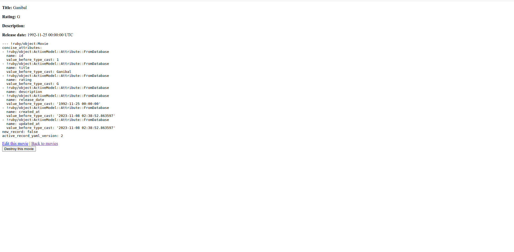
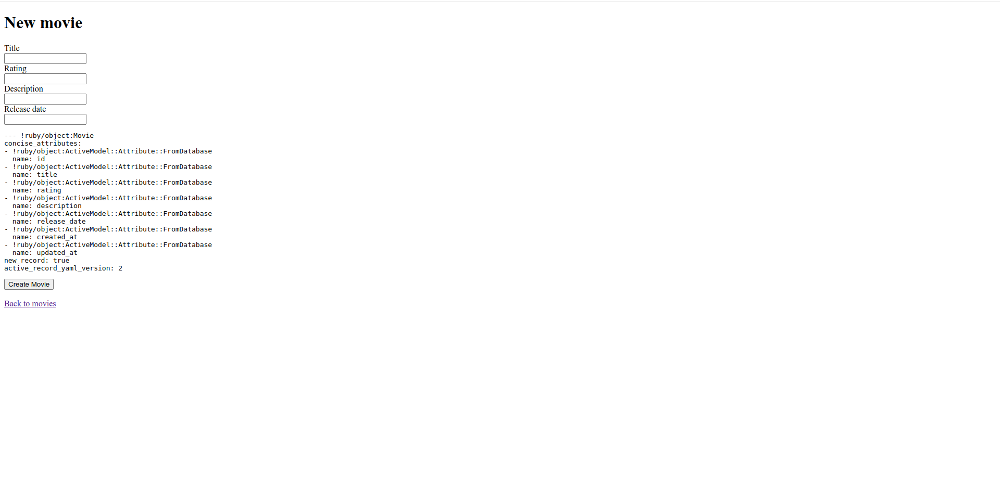
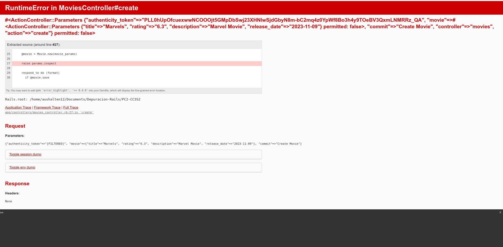
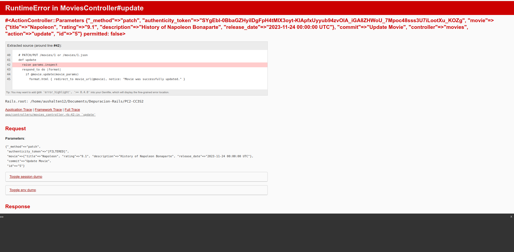
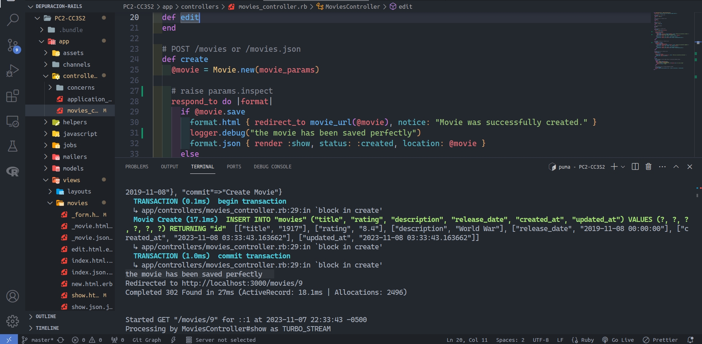
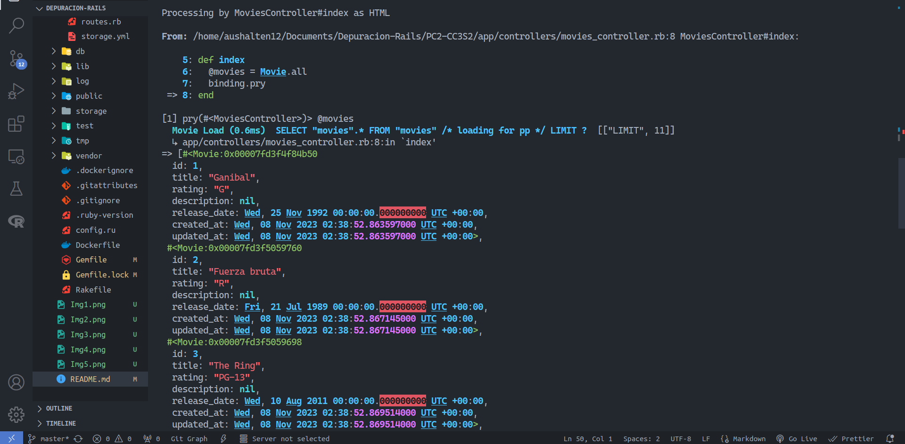
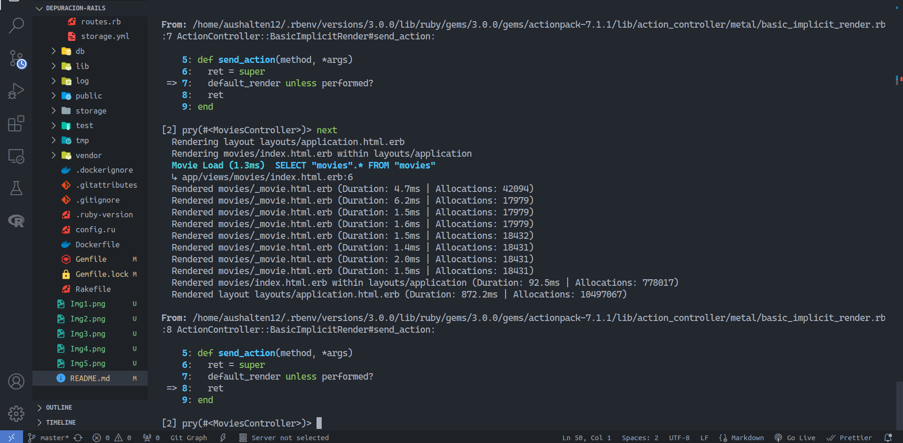
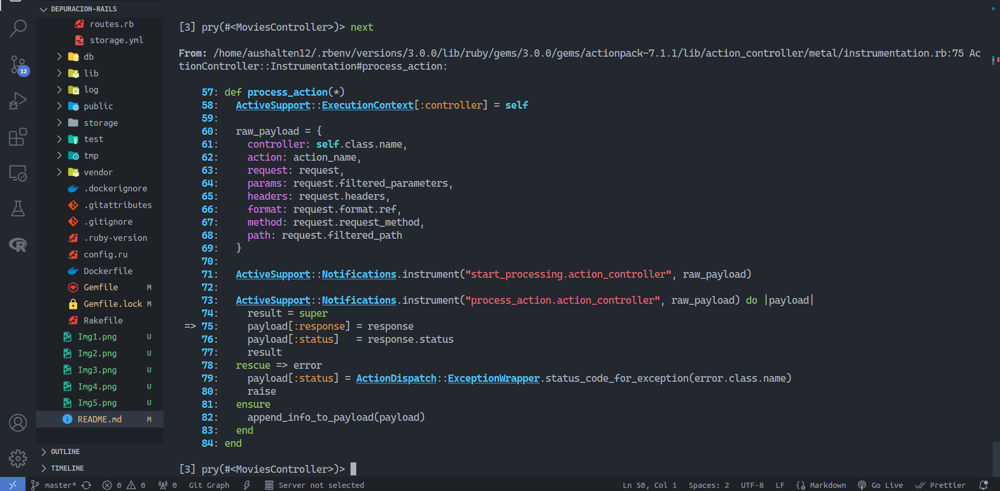
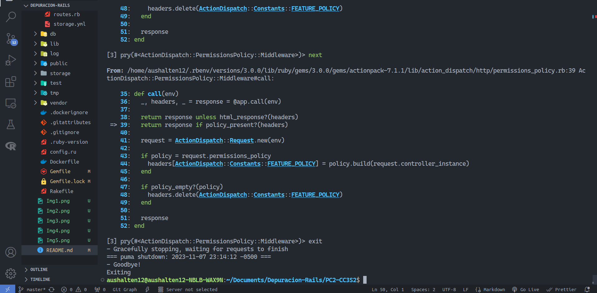

# Actividad

## Depuracion en Rails

Para realizar aquello, usaré la aplicación de Rails realizada en la Practica Calificada 2.

### Acciones
1. Muestra la descripción detallada de un objeto en una vista. Por ejemplo, prueba insertar `= debug(@movie)` o `= @movie.inspect` en cualquier vista (donde el signo `=` le dice a Haml que ejecute el código e inserta el resultado en la vista).
   

- Podemos ver en ese caso el objeto Movie cuyo ID es 1, además de sus atributos, todos `ActiveModel : FromDatabase` y sus valores determinados. 
- Al final se ve el campo `new_record: false` eso es porque ese objeto ya esta almacenado en la base de datos, es decir que si en la vista `create` se debugea el objeto debería retornar `true`.

- Y el ultimo campo es la versión de YAML que es la 2, puede cambiar con actualizaciones en Rails, esta garantiza la relacion y menos erroes en las versiones entre rails y ActiveRecord.

- Todos los campos están sin valores ya que no se han almacenado ningún valor y además el campo `new_record: true`

2. Deten la ejecución dentro de un método de un controlador lanzando una excepción cuyo mensaje sea una representación del valor que quieres inspeccionar, por ejemplo, `raise params.inspect`

- En el controlador movies_controller.rb en el método create la línea de código `raise params.inspect`. Al presionar el botón `create` en la vista. Apareció lo que se ve en la imagen,en esta se ve los parametros del objeto Movie creado, además del token. Se ve que después de los parámetros está el campo `permitted: false` es decir que esos parametros no estan permitidos aun en el controlador y luego aparece esto `"commit"=>"Create Movie", "controller"=>"movies", "action"=>"create"} permitted: false>`, que es la acción que debe realizarse y el controlador en el que está dicha acción, y esto a su vez tampoco esta permitido gracias a la misma excepción que se ejecutó con `raise params.inspect`

3. Para ver el valor detallado de la hash `params` dentro del método de un controlador. Rails desplegará el mensaje de la excepción como la página web resultante de la petición.

- Al igual que el anterior solo que con el método Update. Obtenemos campos similares, obviamente el valor ya cambiado al anterior. Y el metodo `update` aun no esta permitido por la excepcion lanzada con `raise params.inspect`

4. Usa `logger.debug( mensaje)` para imprimir el mensaje al fichero de logging. `logger` está disponible en los modelos y en los controladores y puede registrar mensajes con
distintos niveles de importancia. Compara `config/environments/production.rb` con `development.rb` para ver cómo difieren los niveles logs por defecto entre
los entornos de producción y desarrollo.

- Use `logger.debug(#mensaje)` en el metodo create del controlador, por lo que al crear un nuevo objeto de la clase Movie debe de aparecer ese mensaje en la terminal y así ocurre como se ve en la imagen.

- Las diferencias entre `config/environments/production.rb` y `config/environments/development.rb`. Además de algunas configuraciones para la carga de la aplicación, por ejemplo en desarrollo, se debe recargar en cada cambio hecho a diferencia que en producción no debe de ocurrir. Además en desarrollo de deben manejar de mejor manera las advertencias con respecto a funciones o comportamientos en la aplicación. En producción las configuraciones deben ser más restrictivas de cierta forma para evitar de cierta forma vulneraciones a la aplicación y una mejor experiencia al usuario. 

### Segunda Forma

Instala la gema `debugger` a través de Gemfile, para usar el depurador en una aplicación Rails. 

Arranca el servidor de la aplicación usando  `rails server --debugger`, e inserta la sentencia `debugger` en un punto del código donde desees y detiene el programa. Cuando
llegas a esa sentencia, la ventana del terminal donde arrancó el servidor te dará el prompt del depurador. 

En ese momento en el que estaba ejecutando comandos en la consola la vista index no cargaba al finalizarlo ya habia cargado, bueno en las imagenes se ve que solo mostrar el index necesita de varios métodos para obtener eso y mostrarlo al usuario.