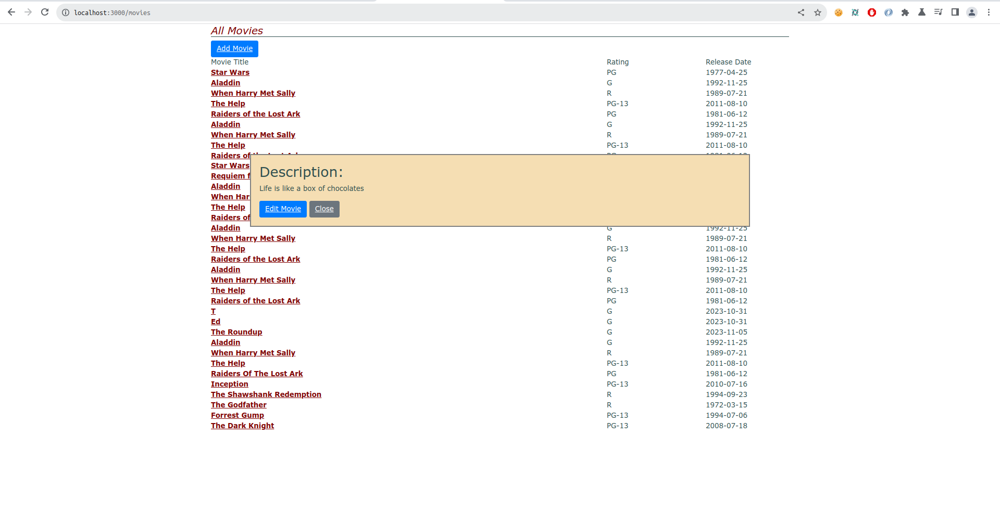

# Actividad AJAX

**Clonamos el repositorio** https://github.com/kapumota/Desarrollo-software-2023/tree/main/Semana8/myrottenpotatoes.

Instalamos las dependencias y realizamos las migraciones de la base de datos y las semillas de cada tabla.

Ejecutamos `rails s` para desplegarlo localmente.

## Parte 1

Usamos la acción en `MoviesController#show`. Modificamos esa acción, si está respondiendo a una petición AJAX, procesará la sencilla vista parcial el código siguiente en lugar de la vista completa.

```movie
 <p> <%= movie.description %> </p>
 <%= link_to 'Edit Movie', edit_movie_path(movie), :class => 'btn btn-primary' %>
 <%= link_to 'Close', '', :id => 'closeLink', :class => 'btn btn-secondary' %>
```

Esa es la vista parcial `_movie.html.erb` que se usará en la vista `show.html.erb`. Y con el siguiente codigo en el controlador.

```ruby
def show
  id = params[:id] # retrieve movie ID from URI route
  @movie = Movie.find(id) # look up movie by unique ID
  # will render render app/views/movies/show.html.haml by default
  render(:partial => 'movie', :object => @movie) if request.xhr?
end
```

el método `render` se ejecuta si la solicitud se realizó a traves de AJAX `request.xhr?`, si es AJAX renderiza solo la vista parcial `movie` sino renderiza la vista completa `show.html.erb`.

## Parte 2

**¿Cómo debería construir y lanzar la petición XHR el código JavaScript? Queremos que la ventana flotante aparezca cuando pinchamos en el enlace que tiene el nombre de la película.**

1. Primero creamos un archivo javascript `movie_popup.js` con el contenido dado e el github.

```ruby
var MoviePopup = {
  setup: function() {
    // add hidden 'div' to end of page to display popup:
    let popupDiv = $('<div id="movieInfo"></div>');
    popupDiv.hide().appendTo($('body'));
    $(document).on('click', '#movies a', MoviePopup.getMovieInfo);
  }
  ,getMovieInfo: function() {
    $.ajax({type: 'GET',
            url: $(this).attr('href'),
            timeout: 5000,
            success: MoviePopup.showMovieInfo,
            error: function(xhrObj, textStatus, exception) { alert('Error!'); }
            // 'success' and 'error' functions will be passed 3 args
           });
    return(false);
  }
  ,showMovieInfo: function(data, requestStatus, xhrObject) {
    // center a floater 1/2 as wide and 1/4 as tall as screen
    let oneFourth = Math.ceil($(window).width() / 4);
    $('#movieInfo').
      css({'left': oneFourth,  'width': 2*oneFourth, 'top': 250}).
      html(data).
      show();
    // make the Close link in the hidden element work
    $('#closeLink').click(MoviePopup.hideMovieInfo);
    return(false);  // prevent default link action
  }
  ,hideMovieInfo: function() {
    $('#movieInfo').hide();
    return(false);
  }
};
$(MoviePopup.setup);
```

Este código Javascript crea un objeto `MoviePopup` esta cuenta con cuatro metodos.

- El método _setup_ : usa Jquery para asignarle a una variable una etiqueta `HTML` y esta se oculta pero a la vez de adiciona al `body` de la vista en este caso `index`. Luego selecciona en el documento, el evento _click_ en los enlaces dentro de la etiqueta con `id='movies'`, al realizarse ese evento se llama a la función **getMovieInfo**
- El método _getMovieInfo_ : Maneja las solicitudes AJAX, si en caso se realice una solicitud AJAX llama a la función **showMovieInfo**
- El método _showMovieInfo_ : Primero se asigna a una variable la coordenada 'x' que luego tendrá la etiqueta con `id='movieInfo'`, usando JQuery. Se le agregan a ese contenedor los datos, y con `show` los muestra al usuario. Selecciona la etiqueta con `id='closeLink'` cuando haya un evento click en esa etiqueta se llama a la funcion **hideMovieInfo**
- El método _hideMovieInfo_ : Usando JQuery selecciona el id `movieInfo` y con el método `hide` lo desaparece o mejor dicho lo vuelve invisible,retorna `false`.

`$(MoviePopup.setup);` espera que el documento, es decir la vista se haya cargado, y luego se ejecuta el método, esto se hace usando JQuery.

El archivo Javascript lo incluimos en `application.html.erb`, la vista de la aplicación.

```ruby
  <%= stylesheet_link_tag 'application', media: 'all', 'data-turbolinks-track': 'reload' %>
  <%= javascript_include_tag 'movie_popup' %>
```
Y tambien application.css, ya que al agregarle estas lineas de código CSS, no veía el cambio pero necesitaba tambien incluirse en la vista de la aplicación.

```css
#movieInfo {
  padding: 2ex;
  position: absolute;
  border: 2px double grey;
  background: wheat;
}
```

### RESULTADO

Le agregé algunas nuevas filas con descripción para ver mejor la ventana emergente, ya que las peliculas ya ingresadas no contaban con descripción.



*Mi explicacion sobre los datos de la ventana emergente*, ya que cuando `MoviePopup` usa showMovieInfo no se ingresa ningun parametro como `data`. Eso es porque, en el controlador de movies, en la acción `show` se escribió una condicional `render(:partial => 'movie', :object => @movie) if request.xhr?`. Con este código javascript, al hacer un click realiza una petición AJAX por lo que solo se renderiza la vista parcial, y esto es la data que necesita el método `showMovieInfo`. Por lo que `closeLink` ya está implementada en la vista parcial `_movie.html.erb`.

## Parte 3

Si el elemento se crea dinamicamente con una clase `myClass` al tener en el código javascript `$(.myClass).on(click,func)` este nuevo elemento no contara con esta respuesta al evento click. Para solucionar esto se usa *la delegación de eventos*. Se selecciona una etiqueta padre, o todo el documento, por ejemplo : 

```javascript
$(document).on('click', '.myClass', function());
```

Aunque si se tuviera una lista y por cada item necesito delegar eventos.

```javascript
$('#lista').on('click', 'li', function());
```

En el archivo `movie_popup` se uso la delegacion de eventos :

```javascript
$(document).on('click', '#movies a', MoviePopup.getMovieInfo);
```
para cada enlace dentro del documento, se le asigno en el evento click, con la función `getMovieInfo`. 